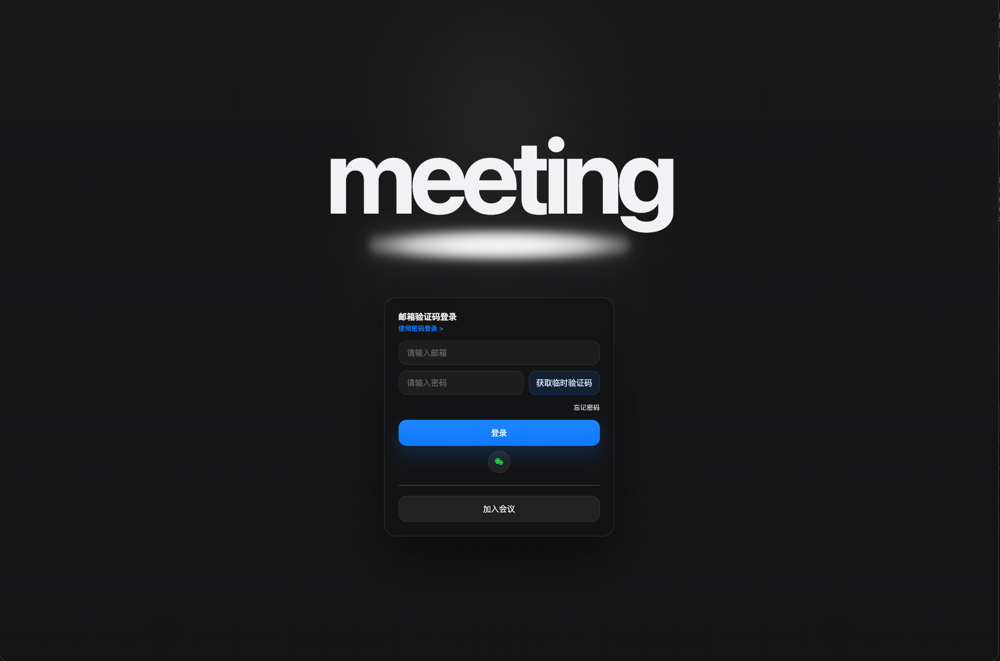

# Meeting

[English](README.md) | 简体中文

`Meeting` 是一个面向 `PC` 浏览器、移动 `H5` 和微信小程序的多人视频会议系统，支持“`P2P` 优先、`TURN` 兜底、服务端仅保留基础审计数据”。

当前能力包括视频会议、白板、共享屏幕、录屏/录音、文字聊天、就位确认、会议纪要、主持人/助理/参会者权限体系、匿名参会者昵称、会后删除会议过程数据，以及基于浏览器可落地实现的 `WSS + WebRTC` 通信模型。



## 架构概览

- 媒体面：`WebRTC`
- 控制面与信令：`WSS`
- 后端：`Golang`
- 数据库：`SQLite3`
- 前端：`TypeScript + React + Vite`
- 数据清理策略：会议运行态只保留在内存，会议结束后立即删除
- 审计策略：仅持久化基础审计事件和注册用户默认媒体偏好

## 核心约束

- `participant` 默认只有文字聊天权限
- `participant` 开启麦克风、摄像头、白板、共享屏幕、录制、就位确认都需要主持人授权
- 主持人可将参会者设为助理，助理拥有已授予的主持权限
- 录屏/录音默认本地录制，不上传服务器
- 临时聊天记录、白板、就位确认结果、临时会议纪要仅保留到会议结束
- 主持人在仍有其他参会者时不能直接离会，必须显式结束会议，避免房间进入无主持人状态

## 模块划分

下表按开源项目常见的“路径 / 职责 / 当前状态”格式整理了当前仓库的模块职责。

| 模块 | 路径 | 职责 | 当前实现情况 |
| --- | --- | --- | --- |
| 服务入口 | `cmd/server` | 组装配置、日志、存储、会议服务、HTTP API 和信令 Hub | 已实现，支持本地启动 |
| 架构决策 | `docs/adr` | 记录项目的重要架构决策、约束和取舍 | 已实现，包含初版架构 ADR |
| 设计资产 | `docs/design` | 存放可复用的 HTML/CSS 设计稿和渲染脚本 | 已实现 |
| 配置模块 | `internal/config` | 加载服务地址、SQLite 路径、日志目录等运行配置 | 已实现 |
| 日志模块 | `internal/logging` | 初始化 JSON 日志、按天轮转和保留策略 | 已实现 |
| 存储模块 | `internal/storage/sqlite` | 持久化审计事件和注册用户默认媒体偏好 | 已实现，未承载会议运行态 |
| 会议领域模块 | `internal/meeting` | 房间、参与者、权限、白板、临时聊天、就位确认、纪要等运行态管理 | 已实现核心能力，仍待继续完善多人 Mesh 稳定性 |
| 认证领域模块 | `internal/auth` | 管理注册 / 登录验证码、会话、密码登录校验和邮件发送 | 已实现 |
| HTTP API 模块 | `internal/httpapi` | 提供创建/加入/离会/结束会议、昵称修改、纪要查询、审计上报等接口 | 已实现基础 API |
| 信令模块 | `internal/signaling` | WebSocket 会话管理、房间广播、能力申请/授权、SDP/ICE 转发、协作事件广播 | 已实现 |
| 前端 API 层 | `web/src/api.ts` | 封装 REST 请求 | 已实现 |
| 前端信令层 | `web/src/signaling.ts` | 封装 WebSocket 连接和消息收发 | 已实现 |
| 前端 RTC 层 | `web/src/rtc.ts` | 管理 `RTCPeerConnection`、轨道同步和基础统计采集 | 已实现 1v1 主链路，待继续做多人 Mesh 稳定化 |
| 前端录制层 | `web/src/recording.ts` | 本地录制缓存、下载保存、丢弃缓存 | 已实现 |
| 前端白板模块 | `web/src/whiteboard.tsx` | 白板绘制与显示 | 已实现 |
| 前端会议控制台 | `web/src/App.tsx` | 产品化登录壳层、入会流程、主舞台、右侧抽屉和会中辅助协作面板 | 已实现 |
| 微信小程序客户端 | `wechat/miniprogram` | 提供小程序登录壳层、显式 token 鉴权封装、加入会议、入会预览和基础会中壳层 | 第一阶段已实现 |

## 需求实现状态

### 已实现

- [x] 会议创建、加入、离开、主持人结束会议
- [x] 主持人 / 助理 / 参会者基础角色模型
- [x] `participant` 默认仅聊天，其他权限需主持人授权
- [x] 1v1 `WebRTC` P2P 建链
- [x] 本地媒体采集、本地/远端视频预览
- [x] 共享屏幕
- [x] 本地录屏/录音缓存、下载、丢弃
- [x] 文字聊天
- [x] 白板协作
- [x] 就位确认
- [x] 临时会议纪要运行态
- [x] 临时会议纪要本地导出
- [x] 基础审计统计上报
- [x] 匿名/注册参会者昵称输入
- [x] 昵称修改并写入聊天留痕
- [x] 公开 `9` 位数字会议号、会议号复制和会中分享二维码
- [x] 会议结束后清理运行态数据

### 部分实现

- [~] 多人视频会议
  当前已具备 1v1 主链路和基础 Mesh 结构，仍需继续做多人 Mesh 稳定性、弱网和退化策略优化。
- [~] 产品化登录与预定会议流程
  当前已实现黑色风格登录壳层、邮箱验证码登录、验证码自动注册、最小密码登录提示、快速会议、预定会议表单、带密码弹窗的加入会议流程，以及 `H5` 的入会预览节点；预定会议仍复用当前创建会议接口，尚未拆分成独立持久化调度模型。
- [~] 会议纪要
  当前支持会中临时纪要、聊天记录、白板数量和就位确认摘要导出；“会议结束时提示主持人保存纪要”尚未补齐。
- [~] 审计日志
  当前已上报延迟、丢包、帧率、码率和连接摘要；仍可继续丰富设备指纹和更细粒度网络信息。
- [~] 微信小程序客户端
  当前第一阶段已实现：支持微信快捷登录、显式 token 登录态保持、首页最近会议、会议查询、带密码加入会议、入会预览和基础会中壳层；音视频和更完整的会中协作能力仍待继续补齐。

### 未实现

- [ ] `TURN` / coturn 部署与穿透失败自动退化链路的生产验证
- [ ] 多人 Mesh 的动态管理和性能优化
- [ ] 微信扫码登录与更完整的账号绑定流程
- [ ] 打开邀请链接后自动回填会议号与密码
- [ ] 会议结束时主持人的纪要保存提示流

## 当前 UI 流程

- 入会前的登录页已经切换为全屏单卡布局：顶部是大号 `meeting` 字标，下方是聚焦光斑，再往下是居中的登录卡片，整体与会中页保持同一套 macOS dark 风格。
- 登录流程已经拆成两个独立入口：`注册` 和 `登录`。注册时先填邮箱、昵称和验证码，验证成功后会自动返回登录页；登录时支持邮箱验证码登录和最小密码登录两种模式，其中验证码登录会在首次成功时自动注册账号。开发模式下验证码仍可自动回填，便于本地联调。
- 验证码请求现在会在服务端执行 `60` 秒冷却：既限制同一邮箱，也限制同一匿名客户端，因此刷新页面或临时修改邮箱都不能立即绕过；同时保留一个更宽松的 IP 兜底限流，避免被恶意批量请求打爆。
- 主持人流程：先登录，再回到黑色产品壳层中选择快速会议或预定会议；两条路径都会先进入 `H5` 入会预览，再正式接入会议。预定会议表单当前仍复用现有创建会议接口，尚未拆分出独立持久化调度模型。
- 加入会议流程：先输入公开 `9` 位会议号并做预检，只有会议需要密码时才会弹出密码悬浮窗；验证通过后会先进入入会预览，再正式加入会议。带空格的 `3-3-3` 会议号也会自动规范化。
- 会中流程：会议房间已经切换为单屏全舞台布局，顶部是标题栏，底部是 dock 工具栏，主持人工具 / 会议工具 / 设置 / 应用 / 结束会议通过贴附式子窗口展开，成员和聊天默认收纳到右侧抽屉。无人开视频 / 共享时显示头像墙；存在活动媒体时切为主画面 + 右侧缩略窗。
- 分享窗口会显示公开 `9` 位会议号、分享二维码和复制入口；会议号按 `3-3-3` 形式分组显示，内部 room id 不再直接暴露给用户。
- 白板、就位确认、临时纪要、审计摘要和权限管理仍然保留，通过菜单、抽屉和浮动窗口围绕主舞台提供。

## API 与运行态说明

当前已实现的关键接口包括：

- `POST /api/meetings`：创建会议
- `GET /api/meetings/{meetingID}`：获取会议快照
- `GET /api/meetings/{meetingID}/minutes`：获取会中临时纪要快照
- `POST /api/meetings/{meetingID}/join`：加入会议
- `POST /api/meetings/{meetingID}/participants/{participantID}/leave`：离开会议
- `POST /api/meetings/{meetingID}/participants/{participantID}/nickname`：修改昵称
- `POST /api/meetings/{meetingID}/participants/{participantID}/capabilities/{capability}/grant`：主持人授权
- `POST /api/meetings/{meetingID}/participants/{participantID}/audit`：上报基础审计数据
- `POST /api/meetings/{meetingID}/end`：主持人结束会议
- `PUT /api/users/{userID}/preferences`：保存注册用户默认媒体偏好
- `GET /ws/meetings/{meetingID}`：WebSocket 信令入口

更完整的接口契约文档见 [docs/api/README.md](docs/api/README.md)。

说明：

- `POST /api/auth/register/code`、`POST /api/auth/register/verify`、`POST /api/auth/login/code`、`POST /api/auth/login/verify`、`GET /api/auth/me`、`POST /api/auth/logout`：注册 / 登录 / 当前用户 / 退出登录接口
- `POST /api/auth/login/password`：最小密码登录接口；未设置密码的账号会返回“请使用邮箱验证码登录”的明确提示
- `POST /api/auth/wechat/mini/login`：微信小程序快捷登录接口；后端使用 `wx.login` 返回的 code 换取 `openid`，并返回显式 `sessionToken`
- `POST /api/meetings` 返回的会议对象现在同时包含内部 `id` 和公开 `meetingNumber`。
- `GET /api/meetings/{meetingID}` 与 `POST /api/meetings/{meetingID}/join` 等会议级接口现在同时接受内部运行态 ID 和公开 `9` 位会议号。
- `GET /ws/meetings/{meetingID}` 仍继续使用内部运行态 ID，以减少对现有信令链路的影响。

## 本地运行

### 后端

```bash
go run ./cmd/server
```

可选环境变量：

- `MEETING_HTTP_ADDR`，默认 `:5180`
- `MEETING_SQLITE_PATH`，默认 `./data/meeting.db`
- `MEETING_LOG_DIR`，默认 `./logs`
- `MEETING_MAILER_MODE`，默认 `debug`，生产环境推荐使用 `sendcloud_api`
- `MEETING_SMTP_HOST`、`MEETING_SMTP_PORT`、`MEETING_SMTP_USERNAME`、`MEETING_SMTP_PASSWORD`
- `MEETING_SMTP_FROM_ADDRESS`、`MEETING_SMTP_FROM_NAME`、`MEETING_SMTP_REQUIRE_TLS`
- `MEETING_SENDCLOUD_API_BASE_URL`、`MEETING_SENDCLOUD_API_USER`、`MEETING_SENDCLOUD_API_KEY`
- `MEETING_SENDCLOUD_FROM_ADDRESS`、`MEETING_SENDCLOUD_FROM_NAME`
- `MEETING_WECHAT_MINIPROGRAM_APP_ID`、`MEETING_WECHAT_MINIPROGRAM_APP_SECRET`
- `MEETING_WECHAT_MINIPROGRAM_API_BASE_URL`
- `MEETING_AUTH_CODE_SUBJECT_PREFIX`

### 生产环境邮件发送

Docker 生产部署建议把 SendCloud API 凭据放在仓库外、发布包外的独立环境文件中，由运维手工创建和维护。

- `docker-compose.yml` 现在会为 `meeting-backend` 读取一个可选的外部 env 文件
- 默认路径：`/data/07c2.com.cn/meeting/meeting-backend.env`
- 如需自定义路径，可在执行 `./start.sh`、`./update.sh` 或 `./crontab.sh add` 前设置 `MEETING_BACKEND_ENV_FILE=/你的路径/backend.env`

示例 `/data/07c2.com.cn/meeting/meeting-backend.env`：

```env
MEETING_MAILER_MODE=sendcloud_api
MEETING_SENDCLOUD_API_BASE_URL=https://api.sendcloud.net/apiv2
MEETING_SENDCLOUD_API_USER=your_sendcloud_api_user
MEETING_SENDCLOUD_API_KEY=your_sendcloud_api_key
MEETING_SENDCLOUD_FROM_ADDRESS=no-reply@mail.07c2.com.cn
MEETING_SENDCLOUD_FROM_NAME=meeting
MEETING_AUTH_CODE_SUBJECT_PREFIX=[meeting]
MEETING_WECHAT_MINIPROGRAM_APP_ID=your_wechat_miniprogram_app_id
MEETING_WECHAT_MINIPROGRAM_APP_SECRET=your_wechat_miniprogram_app_secret
MEETING_WECHAT_MINIPROGRAM_API_BASE_URL=https://api.weixin.qq.com
```

仓库内同时提供了生产配置模版 [scripts/env.example](scripts/env.example)。每次发布打包时，这个文件也会一并进入压缩包根目录，文件名保持为 `env.example`，便于运维复制到 `/data/07c2.com.cn/meeting/meeting-backend.env` 后再手工填写真实凭据。SMTP 仍然保留为备选模式，但生产环境优先推荐 SendCloud API。

### 微信小程序

- 小程序源码位于 `wechat/`
- 用微信开发者工具打开 [wechat/project.config.json](wechat/project.config.json)，并使用对应的小程序 `AppID`
- 需要在微信公众平台配置合法 request 域名，例如 `https://meeting.07c2.com.cn`
- 后端必须配置：
  - `MEETING_WECHAT_MINIPROGRAM_APP_ID`
  - `MEETING_WECHAT_MINIPROGRAM_APP_SECRET`
- 当前第一阶段采用 `wx.login -> POST /api/auth/wechat/mini/login` 的方式完成快捷登录；后端负责调用微信 `jscode2session` 换取 `openid`，必要时自动创建用户，并把显式 `sessionToken` 返回给小程序端，本地保存后通过 `Authorization: Bearer ...` 继续访问认证与会议接口

### 前端

```bash
cd web
npm install
npm run dev
```

前端开发服务器默认监听 `0.0.0.0:5188`。

### 使用 Makefile

```bash
make build
make linux
make pack
make upload
make publish
make run-backend
make run-frontend
make clean
```

说明：

- `make build`：构建后端二进制和前端静态资源，产物写入 `build/`
- 后端构建输出：`build/backend/meeting`
- 前端构建输出：`build/frontend/`
- `make linux`：构建用于 Docker 运行的 Linux/amd64 发布产物；前端生产包默认按同源 `/api` 和 `/ws` 生成，依赖外层 Nginx 反代，只有确实需要跨域部署时才应显式传入 `FRONTEND_API_BASE_URL` / `FRONTEND_SIGNAL_BASE_URL`
- `make pack`：将 `scripts/`、`docker-compose.yml`、后端、前端和 coturn 资源打入 `meeting_${commit}.tar.gz` 与 `latest.txt`
- `make upload`：先上传 `meeting_${commit}.tar.gz`，再上传 `latest.txt`
- `make publish`：执行标准 `clean -> linux -> pack -> upload` 发布流程
- `make run-backend`：启动后端服务，并将运行期日志和 SQLite 数据写入 `build/run/`
- `make run-frontend`：启动前端开发服务器
- 根目录 `scripts/` 放置 Docker 运行辅助脚本（`start.sh`、`stop.sh`、`restart.sh`、`status.sh`、`update.sh`、`upload.sh`、`crontab.sh`）以及邮件发送配置模版 [`env.example`](scripts/env.example)，并且会被每次发布一起打包；其中 `env.example` 会平铺到压缩包根目录
- 发布包里的前端 Nginx 现在会把同源 `/api/` 和 `/ws/` 请求转发到 `meeting-backend`，因此生产环境只要把 `meeting.07c2.com.cn` 反代到 `meeting-frontend`，认证接口和信令都可以继续走同源，不需要后端额外启用 CORS
- 前端运行期日志默认输出到浏览器控制台；`warn`/`error` 和关键 `info` 事件会批量上报到后端 `POST /api/client-logs`，并进入后端 JSON 日志；浏览器本地不再持久化保存这些日志
- `make clean`：删除 `build/` 目录

## 验证命令

```bash
go test ./...
go build ./cmd/server
cd web && npm run build
make build
```

## 数据生命周期

- 房间、参会人员、权限状态、临时聊天记录、白板、就位确认、临时会议纪要：仅运行时内存态
- 会议结束后：立即从内存清理
- 服务器持久化：仅审计事件和注册用户默认媒体偏好

## 许可协议

本项目采用 MIT 许可开源，详见 [LICENSE](LICENSE)。

## 设计资源

- 架构决策：`docs/adr/ADR-0001-20260325-meeting-architecture.md`
- Issue 清单：`docs/issues/README.md`
- TURN 部署说明：`docs/deploy/coturn.md`
- 前端设计资产：`docs/design/`
- UI 落地记录：`docs/design/20260325-product-ui-rollout.md`
